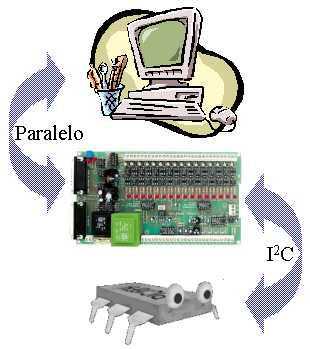

<html>

<head>
<meta http-equiv="Content-Language" content="es">
<meta name="GENERATOR" content="Microsoft FrontPage 4.0">
<meta name="ProgId" content="FrontPage.Editor.Document">
</head>

<b><i>Comunicación bidireccional por bus I2C
      entre un PC y un microcontrolador PIC de gama media actuando como servidor
      de eco.&nbsp;</i></b>
      
Por Alejandro Alonso Puig 
      Noviembre 2.003 
  

 
Este repositorio incorpora el código e informe técnico 
que describe un sistema de comunicación por bus I2C
entre un PC y un microcontrolador PIC de gama media (PIC16F87x) que actuará
como servidor de eco, devolviendo al PC el último byte que le haya sido
enviado. Este sistema estará compuesto por los siguientes elementos
Hardware/Software:&nbsp;

<u>Hardware</u>&nbsp;

  <li>
    
PC&nbsp;</li>
  <li>
    
Tarjeta interface puerto paralelo/bus I2C K8000 de
    Velleman&nbsp;</li>
  <li>
    
Placa con Microcontrolador PIC16F876</li>
 

<u>Software</u>&nbsp;

  <li>
    
Librerías en Visual C++ para el control de la tarjeta
    interface&nbsp;</li>
  <li>
    
Aplicación en Visual C++ para el envío y recepción de
    datos por bus&nbsp; I2C</li>
  <li>
    
Programa servidor de eco en ensamblador para PIC</li>
 
</td>
  
 
Este desarrollo pretende simplemente dar un origen para
futuros trabajos basados en comunicaciones I2C entre PC y
microcontroladores, ya que tanto el programa servidor de eco, como la
aplicación de envío y recepción de bytes del PC, pueden ser modificadas de
forma sencilla para otro tipo de aplicaciones, teniendo ya toda la comunicación
por bus I2C implementada.

Aunque el trabajo ha sido desarrollado sobre plataforma
Windows 98 y con lenguaje Visual C++ 6.0, en el documento se indicará donde
encontrar información para hacer desarrollos similares sobre plataforma Linux o
Windows NT/2000/XP y otros lenguajes, como Visual Basic, Qbasic, Pascal, Borland
C y Java. Asimismo se hará mención a un sustituto de la placa K8000 en caso de
que el lector no pueda disponer de ella.

<ul>
  <li>
    
<a href="I2cPC.pdf">Informe Técnico</a>   
    (.PDF 700kb)</li>
  <li>
    
<a href="LibW9xVCpp.zip">Librerías para
    Visual C++
    sobre Windows 9x</a>  (.ZIP 150kb)</li>
  <li>
    
<a href="I2C_Com.zip">Programa Master de ejemplo en
    Visual C++</a>   (.ZIP 43kb)</li>
  <li>
    
<a href="ECOI2C01_Slave.ASM">Slave servidor de eco en
    ensamblador</a>(.ASM 9Kb)&nbsp;</li>
</ul>

<b>Nota</b>: Master y Slave han de estar conectados mediante tres hilos:
Masa, SCL y SDA. El módulo presentado incluye las resistencias de PullUp, por
lo que no es necesario añadirlas.

   

</body>

</html>
